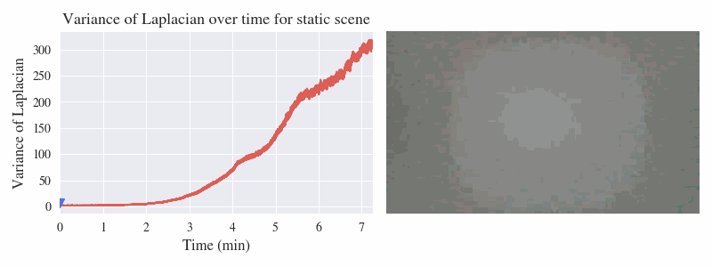

# FogEye - Computational DeFogging via Image-to-Image Translation on a real-world Dataset 
Github io page link | [](http://arxiv.org/abs/2312.02344) | [](https://youtu.be/P8lyz_wZo2c)

The FogEye dataset is available here: [OneDrive]([https://drive.google.com/drive/folders/1Tzo1lDyHiiTZUwWrtjHaJ5GObJZZZMe1?usp=share_link](https://uofutah-my.sharepoint.com/:f:/g/personal/u1259003_umail_utah_edu/EixKW5TDXE9NtsfGnCAcxcsB4uOTbCRi83Eg4y5iKnUHUQ?e=GcZcF4))


## Graphical Abstract
<p align="center">

<figcaption align = "center"><b>Overview of the FogEye project. a): A diagram summarizing the work done in this work. b): Example results obtained by applying the pix2pix framework to the FogEye dataset. Our approach works for a range of fog densities.</b></figcaption>
</p>

## News
nothing to show here

---

<p align="center">

</p>

<p align="center">
<font size = "1"> logo image attributions: <a href="https://commons.wikimedia.org/wiki/File:Utah_Utes_-_U_logo.svg">U of U</a> | <a href="https://commons.wikimedia.org/wiki/File:Deutscher_Akademischer_Austauschdienst_logo.svg">DAAD</a></font>
</p>

This repository documents a research project carried out at the [Laboratory for Optical Nanotechnologies](https://nanoptics.wordpress.com) at the University of Utah under supervision of [Prof. Rajesh Menon](https://faculty.utah.edu/u0676529-Rajesh_Menon/research/index.hml) in Spring (January-April) 2024. It was funded by [Prof. Rajesh Menon].


 real image  |  foggy image  |   reconstructed image 
:-------------------------:|:-------------------------:|:-------------------------:
 |   | 

<p align="center">

<figcaption align = "center"><b>Looping through the epochs of a trained model</b></figcaption>
</p>


## Table of Contents
- [FogEye](#FogEye)
  - [Table of Contents](#table-of-contents)
  - [Goal](#goal)
  - [Potential applications](#potential-applications)
  - [Project timeline](#project-timeline)
  - [Image capturing device](#image-capturing-device)
    - [Requirements](#requirements)
    - [Cameras](#cameras)
      - [HDR](#hdr)
    - [Image trigger](#image-trigger)
    - [Wiring \& Programming](#wiring--programming)
    - [Gimbal](#gimbal)
    - [Case](#case)
    - [Bill of Materials (BoM)](#bill-of-materials-bom)
    - [CAD file attributions](#cad-file-attributions)
  - [Model Training](#model-training)
  - [Getting started](#getting-started)
  - [Synthetic data](#synthetic-data)
    - [Foggy Cityscapes from Uni Tübingen](#foggy-cityscapes-from-uni-tübingen)
    - [Foggy Cityscapes from ETH Zürich](#foggy-cityscapes-from-eth-zürich)
    - [Foggy Carla from Uni Tübingen](#foggy-carla-from-uni-tübingen)
    - [Foggy KITTI from Uni Tübingen (?)](#foggy-kitti-from-uni-tübingen-)
  - [Collected dataset](#collected-dataset)
  - [pix2pix on dataset](#pix2pix-on-dataset)
  - [Limitations](#limitations)
  - [Licensing](#licensing)
  - [Citation](#citation)
  - [References](#references)
  - [Appendix](#appendix)
    - [Fog Decay Study](#fog-decay-study)
    - [Best Performing Metric](#best-performing-metric)
    - [HDR code](#hdr-code)


## Goal
This project has four objectives:

1. add hdr to existing cameras
2. collect a dataset of paired images and add-on to existing data set
3. apply the [pix2pix model](https://phillipi.github.io/pix2pix/) developed at the University of California, Berkeley to the translation problem **fog &rarr; no fog**
4. compare goodness of fit for metrics

## Potential applications

* Autonomous driving
* Search & rescue (wildfires, home fires, etc.)
* Military

## Project timeline
The project was initially carried out over the course three months, from July to September 2023. Continuing contributions have occurred from January to April 2024. 


## Image capturing device

<details>
<summary><strong>click to expand</strong></summary>

### Requirements

The device had to be able to:
* accomodate two cameras
* isolate the cameras from each other
* provide a fog chamber for one of the cameras
* trigger both cameras at the same time

The shift in perspective hailing from the distance the two cameras are set apart will be ignored. The further away the photographed scenes are, the less this will have an effect on the resulting images.

### Cameras
The two identical cameras used for this project had to be:

* programmable
* able to interface with other devices
* small & lightweight
* low power

Therefore, we chose to use the [OpenMV](https://openmv.io) [H7](https://openmv.io/collections/products/products/openmv-cam-h7) cameras for the task. The [OpenMV IDE](https://openmv.io/pages/download) makes it easy to program the camera using `python`. They are able to receive input from their I/O pins as well as output user feedback using their LEDs.

<p align="center">

<figcaption align = "center"><b>OpenMV H7 camera</b></figcaption>
</p>

** Note: OpenMV IDE License must be purchased at [License](https://openmv.io/products/openmv-cam-board-key) for $15 **

### HDR
To improve performance of our Machine Learning model we implemented HDR processing for our training image datasets. By merging multiples of the same image taken at different exposures HDR provides greater contrast and detail, reduced image artifacts, and a wider range of luminance improving the information provided to the algorithm. The HDR is implemented in two stages. Four images of the same scene are recorded by the camera at different exposures ranging around what the auto exposure would be. Those images are then merged in post processing on a separate computer. Potentially, both steps of the process could be handled by moving to a raspberry pi.


### Image trigger
In order to get exactly paired images from both cameras that are captured at the same time, it is necessary to introduce a common trigger. Prior stewards of this project used a lightweight Arduino board for this task. Any Arduino board should be capable of sending this trigger, but an [Adafruit Feather 32u4 Radio](https://learn.adafruit.com/adafruit-feather-32u4-radio-with-rfm69hcw-module) was used that was available from an earlier project. The board was connected to both cameras and sends a trigger signal to both cameras at the same time. The cameras are programmed to capture an image when they receive the trigger signal. [read_external_trigger](https://github.com/Chan-man00/fogeye/blob/main/openmv/read_external_trigger.py)

For more on the arduino setup go [here](https://github.com/Chan-man00/fogeye/blob/main/misc/arduino_info)

</p>

<p align="center">

<figcaption align = "center"><b>Adafruit Feather 32u4 Radio board</b></figcaption>

</p>

Currently, the camera is set up for HDR 4-exposure bursts [push_button_trigger](https://github.com/Chan-man00/fogeye/blob/main/openmv/button_control_4dm.py) and the wiring has been changed over to a push button. The push button switch is run between P0 and ground.

</p>

<p align="center">

<figcaption align = "center"><b>Camera Setup Back</b></figcaption>

</p>

### Gimbal

<p align="center">

<figcaption align = "center"><b>Gimbal model used in this project</b></figcaption>
</p>

In order to stabilize the images while walking and ensure they are approximately level, a gimbal was used to hold the entire device. The gimbal used for this project was the [Hohem iSteady Q](https://store.hohem.com/products/isteady-q). It is a lightweight single-axis gimbal that is able to hold a smartphone.

** For the HDR imaging the gimble was deemed insufficient, a tripod was used instead **

### Case

In order to be able to capture approximately the same image, the cameras had to be mounted as close together as possible. Simultaneously, the case must be able to hold the fog surrounding one camera while isolating the other camera from the influence of the fog, keeping all other conditions the same. Therefore, both cameras are arranged side by side, inside separate chambers.

The case was designed in [Fusion 360](https://www.autodesk.com/products/fusion-360/overview). Some 3D printed files were printed using a [Creality Ender 3 Pro](https://www.creality3dofficial.com/products/ender-3-pro-3d-printer), some on an [Ultimaker S3](https://ultimaker.com/3d-printers/ultimaker-s3). The front plate was lasercut on a CO<sub>2</sub> laser cutter.

<p align="center">

<figcaption align = "center"><b>CAD design of the gimbal mount</b></figcaption>
</p>
<p align="center">

<figcaption align = "center"><b>CAD design of the gimbal bridge</b></figcaption>

</p>
<p align="center">

<figcaption align = "center"><b>Front view of entire CAD design</b></figcaption>
</p>

<p align="center">

<figcaption align = "center"><b>Rear view of entire CAD design</b></figcaption>
</p>

### Handheld fogger

** Various portable foggers are available, but ordering and shipping takes time. **


### Bill of Materials (BoM)
The following components are required for the device:

#### Purchased Parts

*Initial purchase
- 2x [OpenMV H7 camera](https://openmv.io/collections/products/products/openmv-cam-h7)
- 1x [Adafruit Feather board](https://www.adafruit.com/product/3458) (or any other microcontroller capable of this task, i.e., any other microcontroller)
- 1x [Hohem iSteady Q](https://store.hohem.com/products/isteady-q) gimbal
- 2x Toggle switch (any latching switch that can be used to trigger the cameras)
- 1x Breadboard 30x70mm
- 2x Rubber stoppers
- External USB Power Supply

*Secondary purchase
- 1x Push Button Switch
- Various connecting wires
- USB power adapter

#### Manufactured parts
- Back box
- Front plate
- Front camera screw terminal
- Gimbal mount
- Gimbal bridge
- Hinge
- Lock body
- Lock catch
- Lock receptor
- Maintenance door with hinge
- Maintenance door brace
- Rear camera standoff
- Top plate
- Wire restraint

### CAD file attributions

Several parts of the CAD model were adopted from different sources. They are attributed in the following:

<p align="center">

Part | Source | License
--- | --- | ---
OpenMV camera | [GrabCAD](https://grabcad.com/library/openmv-cam-h7-1/details?folder_id=7042713) | [unknown](https://en.wikipedia.org/wiki/Rick_Astley)
Adafruit Feather board | [Adafruit](https://github.com/adafruit/Adafruit_CAD_Parts/blob/main/2795%20Feather%2032u4%20Adalogger/2795%20Feather%2032u4%20Adalogger.step) | [MIT](https://opensource.org/license/mit/)
Prototyping board | [GrabCAD](https://grabcad.com/library/universal_board_30x70mm-1) | [unknown](https://en.wikipedia.org/wiki/Rick_Astley)
Toggle switch | [GrabCAD](https://grabcad.com/library/toggle-switch-37) | [unknown](https://en.wikipedia.org/wiki/Rick_Astley)
DIN912 M3 25mm screw | [3Dfindit](https://www.3dfindit.com/en/digitaltwin/hexagon-socket-head-cap-screws?path=fabory%2F2_socket_products_and_set_screws%2Fdin_912.prj&mident=%7Bfabory%2F2_socket_products_and_set_screws%2Fdin_912.prj%7D%2C016+%7BLINEID%3D50640%7D++%7BNB%3DZylinderschraube+DIN+912+M2x25+55050.020.025%28High%29%7D%2C%7BCNSORDERNO%3D55050.020.025%7D%2C%7BNENNID%3DM2X25%7D%2C%7BD%3D2.0%7D%2C%7BL%3D25.0%7D%2C%7BBRAND%3DFabory%7D%2C%7BSTANDARD%3DDIN+912%7D%2C%7BTHREAD%3DMetric+thread%7D%2C%7BTHREADDIRECTIO%3DRight%7D%2C%7BSTYLE%3D%7D%2C%7BTYPE%3DSocket+cap+screw%7D%2C%7BBASICMATERIAL%3DStainless+steel%7D%2C%7BGRADE%3DA4-70%7D%2C%7BSURFACETREATME%3D%7D%2C%7BHEADSHAPE%3DCylindrical+head%7D%2C%7BDRIVINGFFEATURE%3DHexagon+socket%7D%2C%7BCOLOR%3D%7D%2C%7BCOMPARABLESTAN%3DISO4762%2CASMEB18.3.1M%2CBS4168-1%2CNEN1241%2CNFE25-125%7D%2C%7BADDITIONALINFO%3D%7D%2C%7BROHS%3DY%7D%2C%7BAPPROVAL%3D%7D%2C%7BEANCODE%3D8715494620321%7D%2C%7BINTRASTATCODE%3D73181562%7D%2C%7BECLASS%3D23-11-06-27%7D%2C%7BUNSPSC%3D31161605%7D%2C%7BETIM%3DEC002356%7D%2C%7BPACKAGING%3D500%7D%2C%7BTL%3D0.000%7D%2C%7BVARIANT%3D1%7D%2C%7BFAB_NENN%3DM2x25%7D%2C%7BFAB_GEO%3Db%3D16%3Bd%3DM2%3Bdk+%28max.%29%3D3.8%3BFull+thread+L+%3F%3D20%3Bk+%28max.%29%3D2%3BLength+%28L%29%3D25%3BP%3D0.4%3Bs%3D1.5%7D%2C%7BFAB_ARTICLENUMBER%3D%7D%2C%7BFABNETWEIGHT%3D0.001%7D%2C%7BGEWINDE%3D0%7D%2C%7BP%3D0.400%7D%2C%7BBX%3D16.000%7D%2C%7BDK%3D3.800%7D%2C%7BDA%3D2.600%7D%2C%7BDS%3D2.000%7D%2C%7BE%3D1.730%7D%2C%7BF%3D0.510%7D%2C%7BK%3D2.000%7D%2C%7BR%3D0.100%7D%2C%7BS%3D1.500%7D%2C%7BT%3D1.000%7D%2C%7BV%3D0.200%7D%2C%7BDW%3D3.480%7D%2C%7BW%3D0.550%7D%2C%7BCNSAVOID%3D0%7D%2C%7BLOD%3DHigh%7D%2C%7BSTANDARDSMALL%3Ddin_912.png%7D) | [unknown](https://en.wikipedia.org/wiki/Rick_Astley)
</p>

</details>

## Model Training

The models were either trained on on a personal laptop computer equipped with 64 GB of RAM, a lab computer equipped with a dedicated GPU (NVIDIA GeForce GTX 970), and 64 GB of RAM or on the University of Utah's [Center for High Performance Computing (CHPC)](https://www.chpc.utah.edu) cluster.
All models were trained for the default 200 epochs for the pix2pix model. The training time increased along with the size of the dataset. For the final model, the training time was around 20 hours.

## Getting started
*descriptions on how to get up and running*

<details>
<summary><strong>click to expand</strong></summary>


### 1. Cloning the repository

Clone the repository using `git`:
```bash
git clone https://github.com/apoll2000/FogEye.git
```

Navigate into the repository:
```bash
cd FogEye
```

### 2. Installing a Python environment

Next, an appropriate Python environment needs to be created. All code was run on Python `3.9.7`. For creating the environment, either [`conda`](https://www.anaconda.com) or [`pyenv virtualenv`](https://github.com/pyenv/pyenv-virtualenv) can be used.

---
The environment can be created using `conda` with:
```bash
conda create --name FogEye python=3.9.7
```

Or using `pyenv virtualenv` with:
```bash
pyenv virtualenv 3.9.7 FogEye
```
---
Then activate the environment with:
```bash
conda activate FogEye
```
Or:
```bash
pyenv activate FogEye
```

---
Using `pip`, the required packages can then be installed. (for `conda` environments, execute
```bash
conda install pip
```
before to install pip). The packages are listed in the `requirements.txt` and can be installed with:
```bash
pip install -r requirements.txt
```

In case you want to install them manually, the packages include:

- `numpy`
- `torch`
- `opencv-python`
- `matplotlib`
- ...

It is important that you specify the right `torch` version if you would like to use your CUDA-enabled GPU to train the model, which will drastically reduce training time. See the [PyTorch website](https://pytorch.org/get-started/locally/) for more information.

### 3. Downloading the dataset

The dataset is currently being hosted here:
[TUBCloud](https://tubcloud.tu-berlin.de/s/TWW4ABJSarpZ7Mc). Depending on the further development of the project, this might not be the final storing location.

Place the `FogEye_images` folder into the `datasets` folder of the repository:

```bash
-- datasets
    |-- FogEye_images
        |-- 2023-08-03-04
            |-- A
                |-- 01-04_08_23__1.bmp
                |-- 01-04_08_23__2.bmp
                |-- ...
            |-- B
                |-- 01-04_08_23__1.bmp
                |-- 01-04_08_23__2.bmp
                |-- ...
        |-- ...
```

### 4. Preparing the dataset

The dataset needs to be prepared for training. This includes transforming the folder structure into one compatible with the pix2pix framework and splitting the dataset into training, validation and testing sets. It can be performed using the following command:
```bash
python preprocess_FogEye_dataset.py --dataroot path/to/dataset
```

### 5. Training a model

The model training can be started using the following command:
```bash
python train.py --dataroot path/to/dataset --name name_of_model --model pix2pix --direction BtoA --gpu_ids 0
```

### 6. Testing a model

```bash
python test.py --dataroot path/to/dataset --direction BtoA --model pix2pix --name name_of_model
```

Ample information on the training and testing process and their parameters can be found on the [pix2pix GitHub page](https://github.com/junyanz/pytorch-CycleGAN-and-pix2pix/tree/master).

</details>

### 7. Helper scripts
This GitHub page includes several helper scripts to perform different actions like hyperparameter tuning or epoch visualization.

These are:
Preprocessing:
- `preprocess_FogEye_dataset.py`
Hyperparameter tuning:
- `hyperparameter_dropoutRate.py`
- `hyperparameter_GAN.py`
- `hyperparameter_init_type.py`
- `hyperparameter_lr_policy.py`
- `hyperparameter_n_layers_D.py`
- `hyperparameter_netD.py`
- `hyperparameter_netG.py`
- `hyperparameter_ngf_ndf.py`
- `hyperparameter_normalization.py`
- `hyperparameter_Res9AndMore.py`
- `hyperparameter_supertraining.py`
Visualization:
- `plot_model_results.py`
- `evaluate_model_group.py`

## Synthetic data

<details>
<summary><strong>click to expand</strong></summary>

At the beginning of the project, we experimented with synthetic datasets in combination with the pix2pix model. The datasets used were based on the [Cityscapes dataset](https://www.cityscapes-dataset.com/) as well as on images derived from the [CARLA simulator](https://carla.org/).
The fog simulations generally work either by directly using a depth map that is available for each particular image, or by using the left and right images to calculate the depths in the images, thus reconstructing this depth map. This depth map helps in estimating how strongly the fog affects different parts of the image.

### Semi-synthetic datasets
The datasets in the following are semi-synthetic, meaning that they work with real images, to which the fog has been added synthetically. A disadvantage of this method is that the depth map is never perfect, which can lead to artifacts in the fogged images.

#### Foggy Cityscapes from Uni Tübingen
In cooperation with the researchers [Georg Volk](https://www.embedded.uni-tuebingen.de/en/team/georg-volk/) and [Jörg Gamerdinger](https://embedded.uni-tuebingen.de/en/team/joerg-gamerdinger/) from the University of Tübingen, Germany, we trained a model on synthetic data generated for their paper ["Simulating Photo-realistic Snow and Fog on Existing Images for Enhanced CNN Training and Evaluation"](https://embedded.uni-tuebingen.de/assets/publications/vonBernuth-Volk-Bringmann_Snow_Fog.pdf).

#### Foggy Cityscapes from ETH Zürich
Another dataset taken into consideration was the [Foggy Cityscapes dataset](http://people.ee.ethz.ch/~csakarid/SFSU_synthetic/) from the paper ["Semantic Foggy Scene Understanding with Synthetic Data"](http://people.ee.ethz.ch/~csakarid/SFSU_synthetic/Semantic_foggy_scene_understanding_with_synthetic_data-Sakaridis+Dai+Van_Gool-IJCV-AAM.pdf) by [Sakaridis et al.](https://people.ee.ethz.ch/~csakarid/). The dataset was created by the [Computer Vision Lab](https://www.vision.ee.ethz.ch/en/) of ETH Zürich, Switzerland.

### Fully synthetic datasets
The following dataset was created entirely synthetically. The original images were rendered using a driving simulator, which generated the matching perfect depth maps as well. This way, the fogged images do not show any artifacts.

#### Foggy CARLA from Uni Tübingen
This dataset was created by the researchers [Georg Volk](https://www.embedded.uni-tuebingen.de/en/team/georg-volk/) and [Jörg Gamerdinger](https://embedded.uni-tuebingen.de/en/team/joerg-gamerdinger/) from the University of Tübingen, Germany, using the same technique from the paper ["Simulating Photo-realistic Snow and Fog on Existing Images for Enhanced CNN Training and Evaluation"](https://embedded.uni-tuebingen.de/assets/publications/vonBernuth-Volk-Bringmann_Snow_Fog.pdf). It is based on the [CARLA simulator](https://carla.org/).

</details>

## Collected dataset
*description & details of the collected dataset*
</p>
Originally, approximately 10,000 images of QVGA(240x320 pixels) quality were collected in the RGB565(5 bits for Red and Blue, 6 bits for Green) format. For the implementation of HDR, 244 images were collected in the original format and combined into 61 HDR images, and 2192 images were collected in VGA(480x640 pixels) quality in the raw sensor data format. 

- ~10.3k QVGA(240x320) RGB 565 images have been collected
- 2192 raw data images were collected
- 2436 images were collect for compression into 609 HDR images


## pix2pix on dataset

While HDR processing reduced the total number of images available for training, collection of raw data nullified this reduction through the use of differing levels of gamma correction. By varying the gamma different details are revealed or accentuated.
</p>
*ML results on dataset*


## Limitations

An initial limitaion to the first iteration of the ML model was the homogeneity of the collected data. While the initial data set was larger than the one collected by the second group of participants on this project, it was collected in a small geographic area and under fairly uniform Utah summer conditions. The second dataset expands diversity of setting and weather significantly.   

A second limitation was with the cameras themselves. It is only recently that the cameras have been set to capture data in the raw format, and only at the VGA resolution. All other resolution levels are locked into the RGB565 format. While training at lower resolution for proof of concept is advantageous due to the lower computational time, flexibility in selecting resolution and format is desireable. Additionally, the ability to do the HDR processing in conjunction with image capture would have sped up the process. A platform like the raspberry pi 5 with its capacity to simultaneously operate 2 cameras and then process images in the desired format would have simplified the operation. And at about the same price point as the OpenMV cameras. 


# Licensing

## Code
The code is licensed under the [BSD 3-Clause License](https://opensource.org/licenses/BSD-3-Clause), available under [CODE_LICENSE](CODE_LICENSE.txt).
-> this is taken from pyramid pix2pix

The parts of the code that were adopted from the pix2pix project are licensed under ... MAKE SURE NOT TO VIOLATE PIX2PIX BSD LICENSE HERE

## Dataset
The dataset is licensed under the [Creative Commons Attribution 4.0 International License](https://creativecommons.org/licenses/by/4.0/), available under [DATASET_LICENSE](DATASET_LICENSE.txt).

-> or should this be CC-BY-NC (non-commercial?)

## Hardware
The hardware is licensed under the [CERN Open HArdware License v2 - Weakly Reciprocal (CERN-OHL-W v2)](https://ohwr.org/project/cernohl/wikis/Documents/CERN-OHL-version-2), available under [HARDWARE_LICENSE](HARDWARE_LICENSE.txt).

# Citation

If you use the dataset or any of the code in this repository created by us, please cite the following paper:

```
@misc{pollak2023FogEye,
      title={FogEye -- Computational DeFogging via Image-to-Image Translation on a real-world Dataset}, 
      author={Anton Pollak and Rajesh Menon},
      year={2023},
      eprint={2312.02344},
      archivePrefix={arXiv},
      primaryClass={cs.CV}
}
```
*Add our paper here*

# References

* [1]: “How to Center and Scale Data Using Ployfit.” Stack Overflow, stackoverflow.com/questions/40569675/how-to-center-and-scale-data-using-ployfit. Accessed 28 Mar. 2024.
* [2]: “What Is the Difference between LAR, and the Bisquare Remain Robust ...” Www.mathworks.com, www.mathworks.com/matlabcentral/answers/\183690-what-is-the-difference-between-lar-and-the-bisquare-remain-robust-in-regression-curve-fitting-tool. Accessed 28 Mar. 2024.
* [3]: Wikipedia Contributors. “Coefficient of Determination.” Wikipedia, Wikimedia Foundation, 27 Feb. 2019, en.wikipedia.org/wiki/Coefficient_of_determination.


# Appendix

<details>
<summary><strong>click to expand</strong></summary>

## Fog Decay Study

We conducted a study on how quickly the fog decays in order to know better how often it needs to be replenished. This was done by filling the fog chamber, letting the fog decay and filming the entire decay using both of the cameras. The resulting video of the fogged camera was analyzed by calculating the [Variance of the Laplacian](https://pyimagesearch.com/2015/09/07/blur-detection-with-opencv/) of each frame as a metric for the intensity of the fog. You can see that after about 5 minutes, the fog intensity becomes quite low.


<p align="center">

<figcaption align = "center"><b>Fog decay measurement over time</b></figcaption>
</p>

## Best Performing Metric

We also conducted a study on which metric performed the best over the Variance of the Laplacian, using the coefficient of determination, R^2, to determine goodness of fit.  R^2 describes a proportion of variance in the dependent variable or evaluator (y axis) that can be explained by the independent variable or Variance pf the Laplacian (x axis).

The FogEye data set metric results are available here: [OneDrive]

</details>

